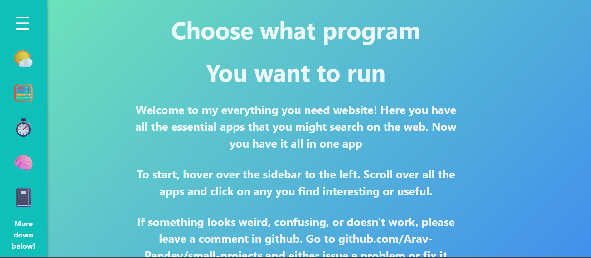

# Everything You Need Website

Everything You Need Website is an app that includes many useful daily applications all in one place.  
Users first log in and are then redirected to the homepage. On the left side, there is a sidebar that allows you to navigate between pages.

Some of my favorite apps are the Weather App, Notes, and the Memory Game.

👉 Visit the app here:  
https://everything-you-need-website.netlify.app

> This project was created by an 11-year-old with help from a tutor.

## 🚀 Demo

Live demo: https://everything-you-need-website.netlify.app

## 📸 Screenshots

## ✨ Features

- User authentication (sign up / login)
- Sidebar navigation
- Multiple built-in applications
- Light and dark mode
- Mobile-friendly design
